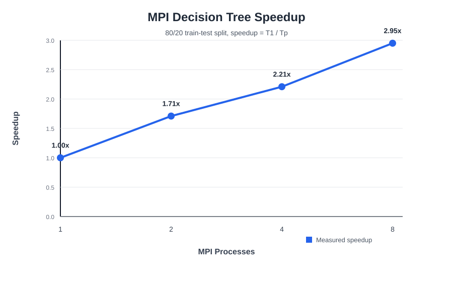
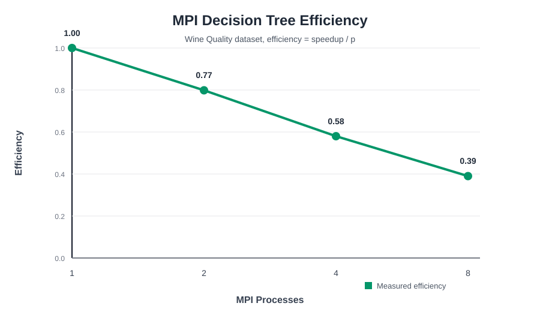

# MPI Decision Tree - Wine Quality


This project implements an MPI Decision Tree classifier in C using MS-MPI on Windows and the Wine Quality dataset (`winequality-white.csv`).

## Dataset

- File: `dataset/winequality-white.csv`
- Delimiter: semicolon (`;`)
- Header row: yes
- Rows: 4,898
- Input features: 11 numeric wine measurements
- Target: `quality`
- Converted classes:
  - Class 0, low: `quality <= 5`
  - Class 1, medium: `quality == 6`
  - Class 2, high: `quality >= 7`

## From Iris To Wine Quality

The Iris dataset usually has 150 rows, 4 features, clean class separation, and 3 balanced species classes. The Wine Quality dataset has 4,898 rows, 11 features, and more class overlap.

Wine Quality is larger and noisier than Iris because the target labels come from subjective quality scores, and wines with neighboring quality values can have very similar chemical measurements. Moderate accuracy is expected because the classes are less separable.

This implementation handles Wine Quality by:

- Reading a semicolon-separated CSV file.
- Skipping the CSV header row.
- Storing 11 features in a flat `double` array for MPI communication.
- Converting numeric quality scores into low, medium, and high classes.
- Using uneven row partitioning with `MPI_Scatterv`, because 4,898 rows may not divide evenly by the process count.

## Model Configuration

The current MPI Decision Tree uses:

- `MAX_DEPTH = 4`
- `NUM_THRESHOLDS = 15`
- `TREE_NODE_COUNT = ((1 << MAX_DEPTH) - 1)`
- Gini impurity for split selection

The implementation uses `MAX_DEPTH = 4`, which creates decision nodes from depth 0 through depth 3. With this array-based complete binary tree layout, there are 15 decision nodes and 16 majority-class leaf predictions.

Each feature evaluates 15 candidate thresholds distributed across the feature range:

```text
min + ((q + 1) / (NUM_THRESHOLDS + 1.0)) * (max - min)
```

for `q = 0` to `NUM_THRESHOLDS - 1`.

Increasing `MAX_DEPTH` to 4 and `NUM_THRESHOLDS` to 15 improves model capacity and raised accuracy to 57.74% on the distributed loaded data. The tradeoff is higher computation time because more tree nodes and more candidate thresholds are evaluated. Wine Quality remains noisy and less separable than Iris, so accuracy is still expected to be moderate.

## MPI Design

Rank 0 reads the full CSV file and initially owns the full dataset:

- Features in a flat `double` array.
- Labels in a flat `int` array.

The MPI collective functions used are:

- `MPI_Bcast`: broadcasts dataset metadata such as row count, feature count, and class count from rank 0 to all processes.
- `MPI_Scatterv`: distributes uneven row partitions to all processes. This is used instead of `MPI_Scatter` because row counts may differ by process.
- `MPI_Gather`: collects each process's local row count on rank 0 for the row distribution output.
- `MPI_Allreduce`: combines global class counts, feature min/max values, and split statistics during Gini impurity calculation. Every rank receives the same global results and builds the same tree.
- `MPI_Reduce`: combines local correct prediction counts into the final global accuracy result, and also reduces elapsed time using the maximum rank time.

`MPI_Barrier` synchronizes ranks before timing starts, and `MPI_Wtime` measures wall-clock execution time for one train + predict run.

## Decision Tree

The classifier uses Gini impurity:

1. Rank-local rows are filtered to the current tree node.
2. Each rank computes local class counts, feature min/max values, and split histograms.
3. `MPI_Allreduce` combines those local statistics into global statistics.
4. Each rank independently selects the same lowest weighted-Gini split.
5. Prediction traverses the trained tree and uses majority-class leaf predictions.

Tree output prints decision nodes from depth 0 through depth 3.

## Compile On Windows With MS-MPI

Open a Developer Command Prompt or a terminal where MS-MPI and the C compiler are available.

Using Microsoft C compiler:

```bat
cl /I"%MSMPI_INC%" src\main.c /link /LIBPATH:"%MSMPI_LIB64%" msmpi.lib /OUT:main.exe
```

If your MS-MPI installation uses explicit paths, an example is:

```bat
cl /I"C:\Program Files (x86)\Microsoft SDKs\MPI\Include" src\main.c /link /LIBPATH:"C:\Program Files (x86)\Microsoft SDKs\MPI\Lib\x64" msmpi.lib /OUT:main.exe
```

## Run

Run from the project root so the default dataset path can be found. The dataset path argument is optional and defaults to:

```text
dataset/winequality-white.csv
```

Run with the default dataset path:

```bat
mpiexec -n 1 main.exe
mpiexec -n 2 main.exe
mpiexec -n 4 main.exe
mpiexec -n 8 main.exe
```

Run with an explicit dataset path:

```bat
mpiexec -n 4 main.exe dataset\winequality-white.csv
```

## Example Terminal Output

```text
Dataset: Wine Quality
Rows: 4898
Features: 11
Classes: 3
Processes: 4
Row distribution:
  Process 0: 1225 rows
  Process 1: 1225 rows
  Process 2: 1224 rows
  Process 3: 1224 rows
Class distribution:
  low: 1640
  medium: 2198
  high: 1060
Depth 0 root node: feature 10 (alcohol), threshold 10.712500
Depth 1 left node: feature 1 (volatile acidity), threshold 0.253437
Depth 1 right node: feature 10 (alcohol), threshold 11.862500
Depth 2 left-left node: feature 1 (volatile acidity), threshold 0.207500
Depth 2 left-right node: feature 10 (alcohol), threshold 9.837500
Depth 2 right-left node: feature 5 (free sulfur dioxide), threshold 11.031250
Depth 2 right-right node: feature 10 (alcohol), threshold 12.762500
Depth 3 left-left-left node: feature 10 (alcohol), threshold 9.181250
Depth 3 left-left-right node: feature 10 (alcohol), threshold 9.856250
Depth 3 left-right-left node: feature 1 (volatile acidity), threshold 0.290000
Depth 3 left-right-right node: feature 5 (free sulfur dioxide), threshold 21.812500
Depth 3 right-left-left node: feature 4 (chlorides), threshold 0.045500
Depth 3 right-left-right node: feature 1 (volatile acidity), threshold 0.478125
Depth 3 right-right-left node: feature 0 (fixed acidity), threshold 7.787500
Depth 3 right-right-right node: feature 5 (free sulfur dioxide), threshold 16.125000
Accuracy: 57.74 %
Execution time: 0.007926 seconds
```

Exact timing can vary by machine, compiler, background load, and process placement.

## Performance, Speedup, And Scalability

Speedup measures how much faster the parallel version is compared with one process:

```text
speedup = T1 / Tp
```

Efficiency measures how well the program uses `p` processes:

```text
efficiency = speedup / p
```

Execution time for one complete training and prediction cycle:

| Processes | Time (s) | Speedup | Efficiency |
|---:|---:|---:|---:|
| 1 | 0.018274 | 1.00 | 1.00 |
| 2 | 0.011891 | 1.54 | 0.77 |
| 4 | 0.007926 | 2.31 | 0.58 |
| 8 | 0.005928 | 3.08 | 0.39 |



Figure 1: Speedup analysis of the MPI Decision Tree implementation.



Figure 2: Efficiency analysis of the MPI Decision Tree implementation.

Scalability means how well the MPI Decision Tree continues to reduce runtime as more processes are added.

## Performance Interpretation

Execution time decreases as process count increases in the measured results. The 8-process run gives the best runtime at 0.005928 seconds, reaching 3.08x speedup compared with 1 process.

Efficiency decreases as process count increases because communication and synchronization overhead become more significant. The Wine Quality dataset has only 4,898 rows, so each process receives fewer rows at high process counts. As local work per process shrinks, the relative cost of `MPI_Allreduce`, `MPI_Reduce`, synchronization, and MPI runtime overhead becomes larger.

The project remains focused on demonstrating distributed-memory training, row distribution, class distribution, speedup, efficiency, and scalability for a parallel machine learning workload.

## Limitations

- The depth-4 tree is still intentionally shallow compared with production decision tree models.
- Only 15 evenly spaced thresholds per feature are tested.
- There is no train/test split; accuracy is measured on the distributed loaded data.
- Wine quality labels are subjective and noisy.
- The goal is MPI parallelization, not maximum ML accuracy.
